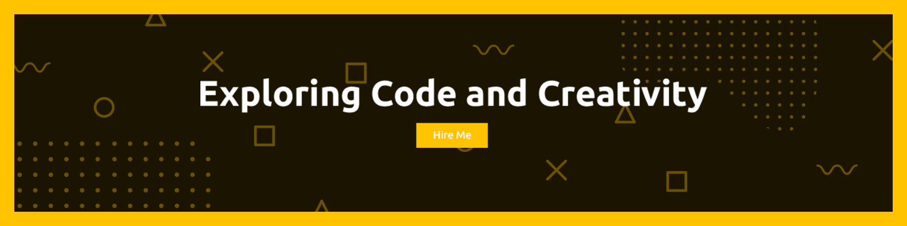

  

##

  <ul align="center" style="list-style: none">
    

      <h1>
        Hi There! Welcome to my Github! 👋
      </h1>
    

  </ul>

Hello, I'm Frankie! I'm a freelance developer with a strong passion for both technology and creativity. I specialize in web development and computer programming, but I also have a deep appreciation for digital art, including design, animation, and video editing. I love building functional and visually appealing projects that blend both technical and artistic skills.

###

##

###

<h3 align="left">🌐 Social Links</h3>

  
  
  
  
  

###

##

###

<h3 align="left">💡 Languages & Frameworks</h3>

  
  
  
  
  
  
  
  
  
  
  
  
  
  

###

##

###

<h3 align="left">⚡ Tools & Softwares</h3>

  
  
  
  
  
  
  
  
  
  

###

##

###

<h3 align="left">🚀 Profile Overview</h3>

  
  

